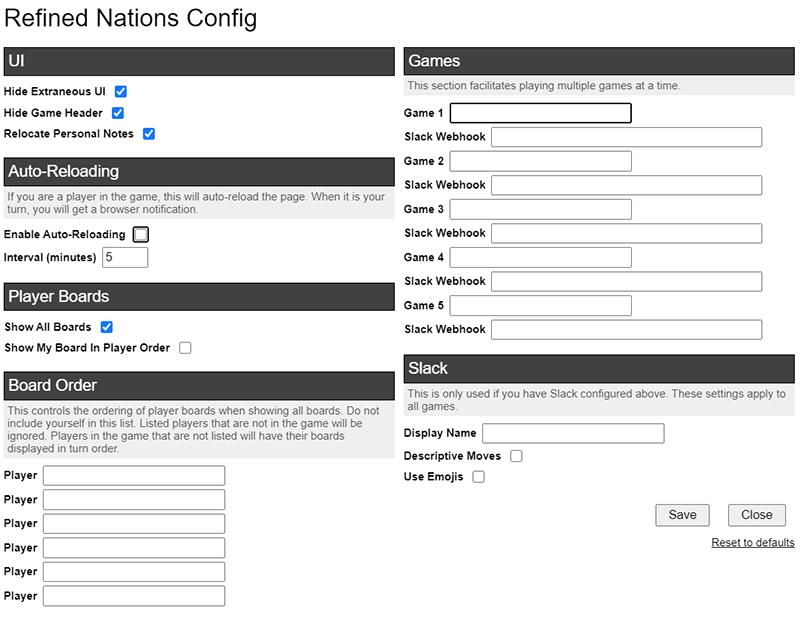
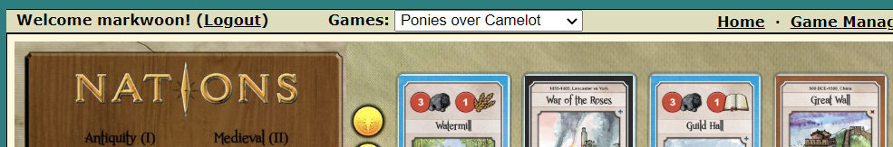

# RefinedNations

This is a userscript for Nations on MaBi Web.

Its goal is to maximize the amount of information displayed at once.  It will:

* Hide all extraneous UI/padding.
* Show all player boards at once (can customize board order; defaults to player's board first, followed by boards in turn order).
* Always display resource production/total vp information (normally only displayed when hovering over resources).
* Integrate personal notes next to player board.
* Adds a "Reload Page" button so you don't have to go back to the Game Manager when you finish your turn.

Additional features:

* Can be configured to auto-reload the page if it's your game.  This will enable you to get notifications when it's your turn.  This feature is disabled by default.
* Can be configured to send notifications to Slack to speed up real-time play.
* If you are playing multiple games at once, you can add game information into the settings panel to get a drop down menu of you games in the header.

Warning: this has only been tested in Chrome and Tampermonkey.

Suggestions/contributions welcome.

## Settings Panel

To configure the script, go to the script's settings:

You should get a settings panel that looks like:

### Game Config

If you configure the games you're playing, React Nations will add a game menu to the header to allow you to easily switch between games.  It's currently capped at 5 games.

The syntax for the game is "`game id`:`name`".  The name is optional, but will make it much easier to identify which game is which.

What is the game id?  You can find it in the URL of the page:

Or in the footer:  

Example:

One you've added that, you'll see your games show up in the header:

### Slack Integration

Refined Nations uses a Slack's `Incoming Webhook` integration to post to your Slack channel.  Follow [these instructions from Slack](https://api.slack.com/messaging/webhooks) to set it up, then copy the Webhook URL into the settings panel.

If you want notifications with emojis, you'll have to add them to Slack.

| name | image |
| --- | --- |
| :food: |  |
| :stone: |  |
| :gold: |  |
| :vp: |  |
| :nations_book: | |
| :meeple_blue: |  |
| :meeple_green: |  |
| :meeple_orange: |  |
| :meeple_pink: |  |
| :meeple_purple: |  |
| :meeple_red: |  |
| :meeple_yellow: |  |
